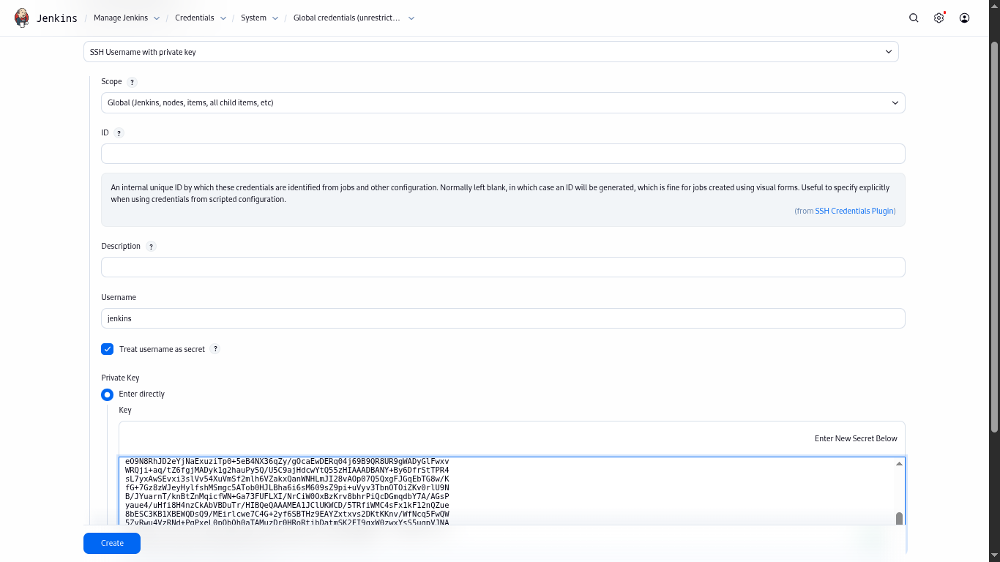
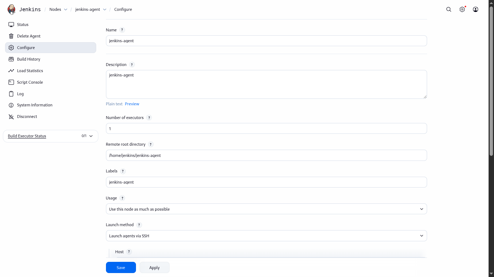
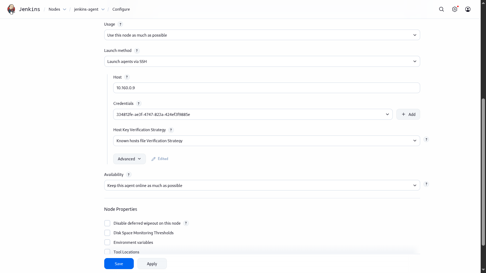

https://www.jenkins.io/doc/book/installing/linux/
# Master node
## update the os and install jre 11

sudo apt update
sudo apt install openjdk-21-jre
java -version

## add jenkins 

sudo wget -O /etc/apt/keyrings/jenkins-keyring.asc \
  https://pkg.jenkins.io/debian-stable/jenkins.io-2023.key
echo "deb [signed-by=/etc/apt/keyrings/jenkins-keyring.asc]" \
  https://pkg.jenkins.io/debian-stable binary/ | sudo tee \
  /etc/apt/sources.list.d/jenkins.list > /dev/null

## update the package and install jenkins

sudo apt update
sudo apt install -y jenkins

## start the jenkins
sudo systemctl start jenkins

## enable the jenkins on start
sudo systemctl enable jenkins

## check status of jenkins
sudo systemctl status jenkins

## retrive the jenkins password
sudo cat /var/lib/jenkins/secrets/initialAdminPassword

#-----------------------------------------------
https://stackoverflow.com/questions/37331571/how-to-setup-ssh-keys-for-jenkins-to-publish-via-ssh
## Node Setup
copy the pubic key to slave node authorized_keys

### to check username
whoami

## ssh-copy-id
ssh-copy-id <user>@<ip>

ssh <user>@<ip>
if able to connect everything is good

## install java on slave machine
sudo apt update
sudo apt install openjdk-21-jre

## create a new username of jenkins
sudo userdel -r jenkins

## switch user to jenkins
su jenkins

## create directory in jenkins
mkdir /home/jenkins/jenkins-agent

mkdir ~/.ssh && cd ~/.ssh

echo "<id_rsa.pub-actual-key>" >> .ssh/authorized_keys

#------------------
credientials ssh with private key

id leave blank

give description : jenkins-agent

username : jenkins (treat as secret)

enter private key 

#-----------
labels: jenkins-agent

remote root dir: /home/jenkins/jenkins-agent

host: <ip>

Host Key Verification Strategy : non verifying verifying strategy

